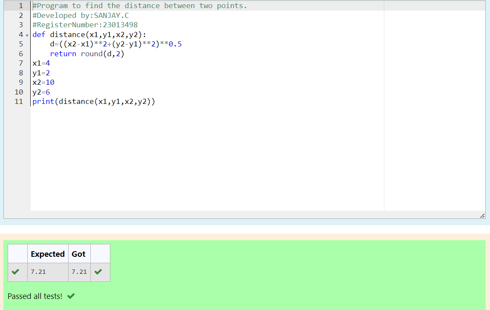

# DISTANCE-BETWEEN-TWO-POINTS

## AIM:
To write a python program to find the distance two 2 points
## ALGORITHM:
### Step 1: 
### Step 2: 
### Step 3: 
Substitute the values in the distance formula  
### Step 4: 
### Step 5: 
### PROGRAM:
```py
#Program to find the distance between two points.
#Developed by:SANJAY.C
#RegisterNumber:23013498
def distance(x1,y1,x2,y2):
    d=((x2-x1)**2+(y2-y1)**2)**0.5
    return round(d,2)
x1=4
y1=2
x2=10
y2=6
print(distance(x1,y1,x2,y2))
```
  

### OUTPUT:


### RESULT:
